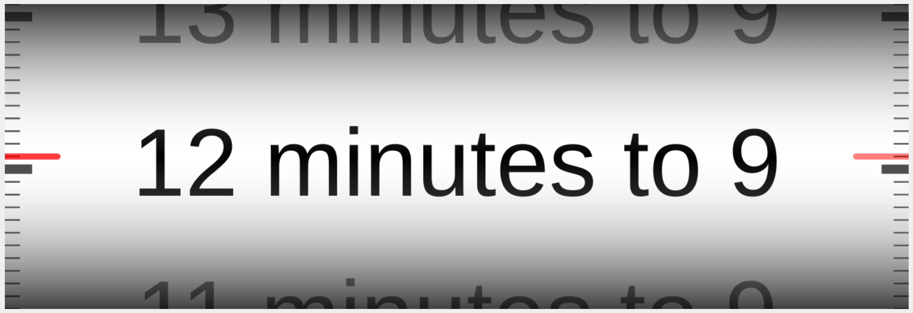

# 3D Rotating Cylinder Clock: Technical Specification

## 1. Introduction

**1.1. Purpose**
This document outlines the technical specifications for a JavaScript library, named `CylinderClock`, designed to render a 3D rotating horizontal cylinder clock within a specified HTML `div` element.

**1.2. Overview**
The library will display the current time as text on the surface of a continuously rotating 3D cylinder. The text will be in British or American English (configurable). The clock will feature visual cues for minutes and 5-second intervals, including markings on the cylinder and static index lines, creating an effect analogous to a second hand. The rendering will fill the target `div` and adapt to its dimensions, typically maintaining a 3:1 aspect ratio for cylinder length to diameter.

---

## 2. General Requirements

**2.1. Rendering Target**
The clock must be rendered into a user-provided HTML `div` element.

**2.2. Dimensions and Responsiveness**

- The rendered clock (cylinder and associated elements) should fill the entire area of the target `div`.
- The library must be responsive to changes in the target `div`'s dimensions, adjusting the clock's size and proportions dynamically.
- The cylinder's length will typically be three times its diameter, corresponding to a target `div` with a 3:1 width-to-height aspect ratio. If the `div` has a different aspect ratio, the library should still fill the div, potentially adjusting the cylinder's relative length/diameter or field of view to best utilize the space while maintaining visual integrity. The primary constraint is that the cylinder's diameter matches the div height.

---

## 3. Visual Appearance

**3.1. 3D Cylinder**

- **Orientation**: The cylinder will be oriented horizontally.
- **Appearance**: It must be rendered as a realistic 3D object with a curved surface. Basic lighting (e.g., ambient and one directional light) should be applied to give a sense of depth and form. The cylinder should have a semi-reflective surface (like ivory but without imperfections such as Schreger lines or growth rings).
- **Rotation**:
  - The cylinder rotates around its horizontal axis.
  - From the viewer's perspective, the text on the front surface of the cylinder scrolls upwards.
  - The rotation should be smooth and continuous.

**3.2. Time Text**

- **Content**: Text representing the time is rendered directly onto the cylinder's surface. The text should use an "emboss" effect, i.e. a three-dimensional effect, where the text is slightly raised above the cylinder surface. The text should appear to be sculpted from polished graphite.
- **Language/Format**: Time is displayed in British or American English. See **Appendix A** and **Appendix B** for specific formatting rules.
- **Arrangement**:
  - There will be one unique line of text for each of the 60 minutes in an hour.
  - The text line corresponding to the current minute (at 0 seconds) is visually centered with the static red index lines.
  - The text for the minute immediately preceding the current minute will be visible above the current time, rotating out of view at the top edge of the cylinder.
  - The text for the minute immediately following the current time will be visible below the current time, rotating into view from the bottom edge of the cylinder.
- **Font**:
  - The font family will be configurable.
  - Font size will be determined dynamically based on the cylinder's diameter (and thus the `div` height) to ensure readability and optimal use of space.
- **Color**: Text color will be configurable.

**3.3. Time Indication Markings**

- **Black Marks (on cylinder surface)**:
  - These marks are part of the cylinder's texture and rotate with it.
  - They are located on the extreme left and right sides of the cylinder, flanking the time text area.
  - Their visual appearance should be similar to that of the text (i.e. embossed and sculpted from polished graphite).
  - For each minute interval on the cylinder:
    - One **major mark** (larger) is aligned with the corresponding minute's text line. This mark signifies the start of the minute (0 seconds).
    - Eleven **minor marks** (smaller) are evenly spaced below their corresponding major mark, within that minute's segment. Each minor mark represents a 5-second interval (5s, 10s, ..., 55s).
  - Color of major and minor marks will be configurable.
- **Red Index Lines (static overlay)**:
  - One translucent horizontal line on each side of the cylinder, about the same width as a minor mark.
  - They are rendered separately and appear in front of the cylinder; they do not rotate.
  - There will be one red line on the left and one on the right, aligned with the columns of black marks.
  - Vertically, they are positioned at the imaginary centerline of the "current time" display area (i.e., the vertical center of the target `div`).
  - Function: They act as static pointers. As the cylinder rotates, the black marks scroll past these red lines, allowing the viewer to gauge the current 5-second interval of the current minute.
  - Color and opacity will be configurable.

A very approximate graphical mockup is below. Note, however, that this mockup is imperfect in that it depicts the cylinder looking 'flat' rather than curved/3D. The requirement is for a realistic looking cylinder that looks curved with text and markers that appear to be embossed on its surface.

---

## 4. Functional Behavior

**4.1. Time Source**
By default, the clock will display the current system time of the client. An option to manually set the time may be provided.

**4.2. Updates**
The clock's rotation and, consequently, the displayed time, must update smoothly. This should be tied to the browser's rendering loop (e.g., using `requestAnimationFrame`).

**4.3. Rotation Mechanics**

- The cylinder's texture will represent a full 60 minutes.
- The cylinder will complete one full rotation around its axis every hour.
- The rotation speed is constant, effectively scrolling the view by one "minute segment" (the height occupied by one minute's text and its associated 12 five-second marks) every 60 seconds.
- The exact rotational position is determined by the current minute and second of the hour.

---

## 5. API Specification

**5.1. Constructor**
`new CylinderClock(targetElement, options)`

- `targetElement` (HTMLElement): The `div` element in which the clock will be rendered. The library will throw an error if this element is not provided or invalid.
- `options` (Object, optional): An object to configure the clock's appearance and behavior.

**5.2. Configuration Options (`options` object)**
| Option | Type | Default Value | Description |
| :--------------------- | :----- | :----------------------- | :-------------------------------------------------------------------------- |
| `language` | string | `'en-US'` | Specifies the language for time text. Supported: `'en-US'` (American English), `'en-GB'` (British English). |
| `textColor` | string | `'#000000'` | CSS color for the time text. |
| `cylinderSurfaceColor` | string | `'#FFFFFF'` | Background color of the cylinder surface where text and marks are drawn. |
| `redLineColor` | string | `'rgba(255, 0, 0, 0.7)'` | CSS color for the static red index lines (e.g., `rgba(r,g,b,a)` or hex). |
| `majorMarkColor` | string | `'#000000'` | CSS color for the major (minute) black marks on the cylinder. |
| `minorMarkColor` | string | `'#333333'` | CSS color for the minor (5-second) black marks on the cylinder. |
| `fontFamily` | string | `'Arial, sans-serif'` | Font family for the time text. |
| `textVerticalAlign` | string | `'middle'` | Vertical alignment of text within its allotted band ('top', 'middle', 'bottom'). This affects placement relative to the major minute mark. |

**5.3. Instance Methods**

- `destroy()`:
  - Stops all animation and updates.
  - Removes any event listeners set up by the library.
  - Clears the clock rendering from the target `div` and releases associated resources (e.g., WebGL context, textures, geometries).
- `setTime(dateObject)`:
  - `dateObject` (Date): A JavaScript `Date` object.
  - Manually sets the clock to display the time specified by `dateObject`. The clock will then continue to advance from this set time. If not called, system time is used.

---

## 6. Technical Implementation Details

**6.1. Rendering Engine**

- **WebGL**: The clock must be rendered using WebGL to achieve a polished and realistic 3D effect.
- **Three.js**: Three.js or a similar library shall be used to manage the WebGL scene, objects, camera, lighting, and rendering, as this will simplify development significantly.

**6.2. Texture Generation**

- A single, comprehensive 2D texture should be generated programmatically.
- This texture will contain:
  - The textual representation for each of the 60 minutes in an hour, according to Appendix A.
  - The corresponding major black mark for each minute.
  - The eleven minor black marks for each minute.
- This texture will be mapped onto the surface of the 3D cylinder model.
- A 2D `<canvas>` element can be used in memory to draw this texture, which is then used as a source for the WebGL texture.
- The texture height should be sufficient to render text clearly. Font size for the texture should be chosen to look good when mapped to the cylinder of varying screen sizes.

**6.3. 3D Scene Setup**

- **Camera**: A Three.js `PerspectiveCamera` is required to provide the 3D perspective. Its position and field of view should be configured to frame the cylinder appropriately within the target `div`, maintaining the 3:1 length-to-diameter visual.
- **Lighting**: At least one `AmbientLight` (for overall visibility) and one `DirectionalLight` (to create highlights and shadows for 3D definition) should be used.
- **Cylinder Geometry**: A standard cylinder mesh. The UV mapping must be set up to correctly apply the generated time texture.

**6.4. Animation**

- All animation (cylinder rotation) must be handled via `window.requestAnimationFrame` for smooth, efficient updates synchronized with the browser's repaint cycle. Since the cylinder will appear to rotate quite slowly, the frame rate can afford to be throttled (60 Hz should be ample).

**6.5. Responsiveness**

- The library must listen for `resize` events (e.g., on the `window` or use a `ResizeObserver` on the `targetElement`).
- On resize, the WebGL renderer, camera aspect ratio, and potentially cylinder geometry or positioning must be updated to ensure the clock continues to fill the `div` correctly and maintain its proportions.

---

## 7. Performance Considerations

- **Texture Optimization**: The main time texture should ideally be generated once at initialization.
- **WebGL Best Practices**: Efficient use of WebGL resources (geometry, materials, shaders). Minimize draw calls.
- **Resource Management**: Proper cleanup of WebGL contexts, textures, buffers, and event listeners when `destroy()` is called.
- **CPU Usage**: JavaScript calculations in the animation loop should be kept minimal.

---

## 8. Browser Compatibility

- The library should target modern evergreen web browsers that have stable support for WebGL and ES6+ JavaScript features (e.g., latest Chrome, Firefox, Safari, Edge).

---

## 9. Error Handling

- The constructor should throw an error if the `targetElement` is not a valid DOM element.
- Graceful failure or informative console errors should occur if WebGL context creation fails.

---

## Appendix A: British English Time Text Generation

A helper function, say `getTimeString(dateObject)`, will be responsible for generating the time string.

**Input**: A JavaScript `Date` object.
**Output**: A string representing the time in British English.

**Logic**:

1.  Extract hours (`h24`, 0-23) and minutes (`m`, 0-59) from the `dateObject`.
2.  Determine the display hour (`H_display`) for "past" phrases: `H_display = (h24 % 12 === 0) ? 12 : h24 % 12;`
3.  Determine the display hour for "to" phrases (`H_next_display`): `let H_next_h24 = (h24 + 1) % 24; H_next_display = (H_next_h24 % 12 === 0) ? 12 : H_next_h24 % 12;`

**Minute formatting rules**:

- If `m == 0`: Return `"${H_display} o'clock"`
- If `m == 1`: Return `"One minute past ${H_display}"`
- If `m > 1 && m < 15`: Return `"${m} minutes past ${H_display}"`
- If `m == 15`: Return `"Quarter past ${H_display}"`
- If `m > 15 && m < 30`: Return `"${m} minutes past ${H_display}"`
- If `m == 30`: Return `"Half past ${H_display}"`
- If `m > 30 && m < 45`:
  - Let `minutes_to = 60 - m;`
  - Return `"${minutes_to} minutes to ${H_next_display}"`
- If `m == 45`: Return `"Quarter to ${H_next_display}"`
- If `m > 45 && m < 59`:
  - Let `minutes_to = 60 - m;`
  - Return `"${minutes_to} minutes to ${H_next_display}"`
- If `m == 59`: Return `"One minute to ${H_next_display}"`

**Example Output**:

- 10:00 -> "10 o'clock"
- 10:01 -> "One minute past 10"
- 10:12 -> "12 minutes past 10"
- 10:15 -> "Quarter past 10"
- 10:25 -> "25 minutes past 10"
- 10:30 -> "Half past 10"
- 10:35 -> "25 minutes to 11" (60-35=25)
- 10:45 -> "Quarter to 11"
- 10:50 -> "10 minutes to 11" (60-50=10)
- 10:59 -> "One minute to 11"
- 23:59 -> "One minute to 12" (for midnight)
- 00:15 -> "Quarter past 12" (for 12:15 AM)

---

## Appendix B: American English Time Text Generation

**Input**: A JavaScript `Date` object.
**Output**: A string representing the time in American English.

**Logic**:

1.  Extract hours (`h24`, 0-23) and minutes (`m`, 0-59) from the `dateObject`.
2.  Determine the numerical display hour (`H_display_num`) for phrases indicating minutes "after" the hour:
    `H_display_num = (h24 % 12 === 0) ? 12 : h24 % 12;`
3.  Determine the numerical display hour (`H_next_display_num`) for phrases indicating minutes "to" the next hour:
    `let h_next_24 = (h24 + 1) % 24;`
    `H_next_display_num = (h_next_24 % 12 === 0) ? 12 : h_next_24 % 12;`

**Minute formatting rules**:

- If `m == 0`: Return `"${H_display_num} o'clock"`
- If `m == 1`: Return `"One minute after ${H_display_num}"`
- If `m > 1 && m < 15`: Return `"${m} minutes after ${H_display_num}"`
- If `m == 15`: Return `"Quarter after ${H_display_num}"`
- If `m > 15 && m < 30`: Return `"${m} minutes after ${H_display_num}"`
- If `m == 30`: Return `"${H_display_num} thirty"`
- If `m > 30 && m < 45`:
  - Let `minutes_to = 60 - m;`
  - If `minutes_to == 1`: Return `"One minute to ${H_next_display_num}"`
  - Else: Return `"${minutes_to} minutes to ${H_next_display_num}"`
- If `m == 45`: Return `"Quarter to ${H_next_display_num}"`
- If `m > 45 && m < 59`:
  - Let `minutes_to = 60 - m;`
  - If `minutes_to == 1`: Return `"One minute to ${H_next_display_num}"`
  - Else: Return `"${minutes_to} minutes to ${H_next_display_num}"`
- If `m == 59`: Return `"One minute to ${H_next_display_num}"`

**Example Output**:

- 10:00 -> "10 o'clock"
- 10:01 -> "One minute after 10"
- 10:12 -> "12 minutes after 10"
- 10:15 -> "Quarter after 10"
- 10:25 -> "25 minutes after 10"
- 10:30 -> "10 thirty"
- 10:35 -> "25 minutes to 11"
- 10:45 -> "Quarter to 11"
- 10:50 -> "10 minutes to 11"
- 10:59 -> "One minute to 11"
- 23:30 -> "11 thirty" (referring to 11 PM)
- 00:00 -> "12 o'clock" (referring to 12 AM, midnight)
- 12:15 -> "Quarter after 12" (referring to 12:15 PM, noon)
